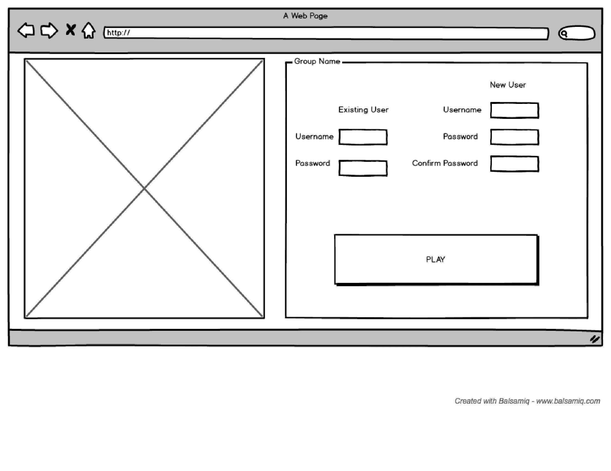
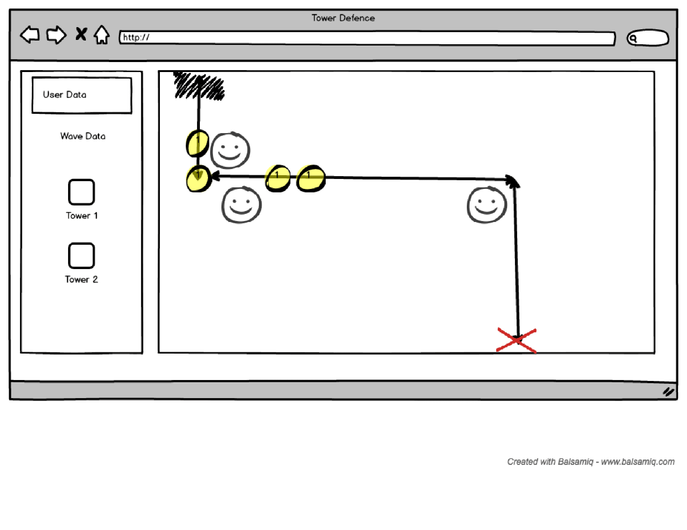

# project-1-tower-defence
Tower Defence game for Project 1 - Javascript

#explanations of the technologies used
-P5.js
-P5.play
-both of these libraries are built ontop of canvas, with P5 following the idea of processing.
-processing is a carry over from when java was used to build applets to display on the screen.
-p5.play did lots of heavy lifting in the drawing objects category.
-other than those two libraries, I used JS to live update the dom with global variables tied to gold, lives, and other player data.

#the approach taken
-programatic thinking
-psuedocoding
-breaking apart problems into smaller chunks
	-Especially when it came to to the waves and towers and bullets, I had to track so many objects that it became overwhelming.

#installation instructions
-First i had to get a copy of p5 and p5.play
-also because of CORS errors i had to load everything on a local server while testing.
-Then i used node/heroku to push my page live. (had some issues with gh-pages)

#unsolved problems
-upgrades ATM apply to ALL towers. I would like each tower to have an upgrade tree to allow tower specialization.
-unable to get different types of towers to be placed. 
-unable to avoid "detouring" (placing a tower in the center of the path)

[Trello](https://trello.com/b/IFHNHQ3u/project-1-wdi-tower-defence)

[The Game itself](https://tower-defence.herokuapp.com/index.html)
